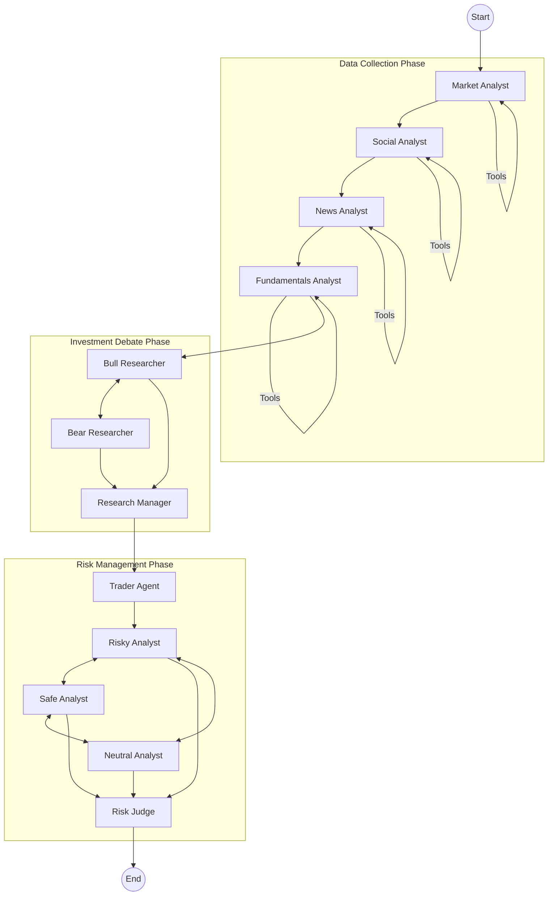

# Sane-Jtreet
## LLM-Powered Financial Trading Research Platform

Sane-Jtreet is an advanced financial research platform that leverages a multi-agent Large Language Model (LLM) system to perform autonomous stock analysis. By simulating a team of financial analysts, researchers, and traders, the system gathers real-time data, debates investment theses, and formulates comprehensive trading strategies.

## Overview

The core of Sane-Jtreet is a graph-based agent workflow (built with **LangGraph**) that orchestrates collaboration between specialized AI agents. These agents act as:

*   **Analysts**: Gather data on market trends, news, social sentiment, and fundamentals.
*   **Researchers**: Formulate bullish and bearish cases based on the data.
*   **Debaters**: Critique each other's arguments to reach a balanced consensus.
*   **Trader**: Proposes a preliminary investment plan.
*   **Risk Managers**: Evaluate the plan against risk parameters before a final decision.

The platform includes a modern **React** frontend for users to visualize the analysis, track agent decisions, and monitor stock performance.

## Architecture

The project is divided into a Python backend and a React frontend, containerized using Docker.

### Tech Stack

*   **Backend**:
    *   **Framework**: FastAPI
    *   **Orchestration**: LangChain, LangGraph
    *   **LLMs**: Support for OpenAI, Anthropic, Google Gemini (via LangChain)
    *   **Data Providers**: YFinance, Finnhub, Reddit, DuckDuckGo/Google News
    *   **Database**: PostgreSQL (Structured Data), ChromaDB (Vector/Memory), Redis (Caching)
*   **Frontend**:
    *   **Framework**: React (Vite)
    *   **Styling**: Tailwind CSS
    *   **Components**: Shadcn/UI, Recharts
*   **Infrastructure**:
    *   Docker & Docker Compose

### System Workflow

The following diagram illustrates the autonomous workflow of the trading agents:



## Core Components

### Agents & Roles

1.  **Analysts**:
    *   **Market Analyst**: Analyzes technical indicators (MACD, RSI, Bollinger Bands) and price action using `yfinance` and `stockstats`.
    *   **Social Analyst**: Gauges sentiment from Reddit (r/wallstreetbets, r/stocks, etc.) and other social sources.
    *   **News Analyst**: Aggregates global news and specific stock news using Google News and Finnhub.
    *   **Fundamentals Analyst**: Reviews balance sheets, income statements, and insider trading activity.

2.  **Researchers**:
    *   **Bull Researcher**: focus on positive indicators to build a "Long" thesis.
    *   **Bear Researcher**: focus on negative indicators to build a "Short" thesis.
    *   **Research Manager**: Moderates the debate between Bull and Bear to synthesize a balanced view.

3.  **Trader**:
    *   Reviews the synthesized report and proposes a concrete trading plan (Entry, Exit, Stop Loss).

4.  **Risk Management Team**:
    *   **Debaters (Risky/Safe/Neutral)**: Challenge the Trader's plan from different risk perspectives.
    *   **Risk Judge**: Makes the final "Go/No-Go" decision and adjusts position sizing or limits.

### Memory & Reflection
The system utilizes a long-term memory module (`FinancialSituationMemory`) powered by **ChromaDB**. After every trade cycle, agents "reflect" on the outcome (Profit/Loss). These reflections are stored and retrieved in future similar market conditions, allowing the agents to "learn" and avoid repeating mistakes.

## Installation & Setup

### Prerequisites
*   Docker & Docker Compose
*   Python 3.13+ (if running locally)
*   Node.js 20+ (if running locally)
*   API Keys:
    *   OpenAI / Anthropic / Google (LLM)
    *   Finnhub (Financial Data)
    *   Reddit (Social Data)

### Environment Variables
Create a `.env` file in the root directory (copy from `.env.example` if available) and populate:

```ini
# LLM Providers
OPENAI_API_KEY=sk-...
ANTHROPIC_API_KEY=...
GOOGLE_API_KEY=...

# Data Providers
FINNHUB_API_KEY=...
REDDIT_CLIENT_ID=...
REDDIT_CLIENT_SECRET=...
REDDIT_USER_AGENT=...

# Configuration
TRADINGAGENTS_RESULTS_DIR=./results
```

### Running with Docker (Recommended)

To start the full stack (Database, Backend, Frontend):

```bash
docker-compose -f docker-compose.dev.yml up --build
```

*   **Frontend**: http://localhost:5173
*   **Backend API**: http://localhost:8000
*   **API Docs**: http://localhost:8000/docs

### Running Locally

**Backend**:
```bash
cd backend
# Install dependencies (using uv or pip)
pip install -e .
# Run the app
uvicorn app:app --reload
```

**Frontend**:
```bash
cd frontend
npm install
npm run dev
```

## Project Structure

```
Sane-Jtreet/
├── backend/                  # Python Backend (FastAPI + Agents)
│   ├── app/
│   │   ├── agents/           # Agent Logic (Analysts, Researchers, Trader)
│   │   ├── core/             # Config & Database setup
│   │   ├── dataflows/        # Data fetching tools (YFinance, Reddit, etc.)
│   │   ├── graph/            # LangGraph workflow definition
│   │   └── models/           # DB Models
│   ├── pyproject.toml        # Backend Dependencies
│   └── Dockerfile
├── frontend/                 # React Frontend
│   ├── src/
│   │   ├── components/       # UI Components (Charts, Dashboards)
│   │   └── App.tsx
│   └── package.json
├── docker-compose.dev.yml    # Development Orchestration
└── README.md                 # Documentation
```

## License

This project is licensed under the MIT License.